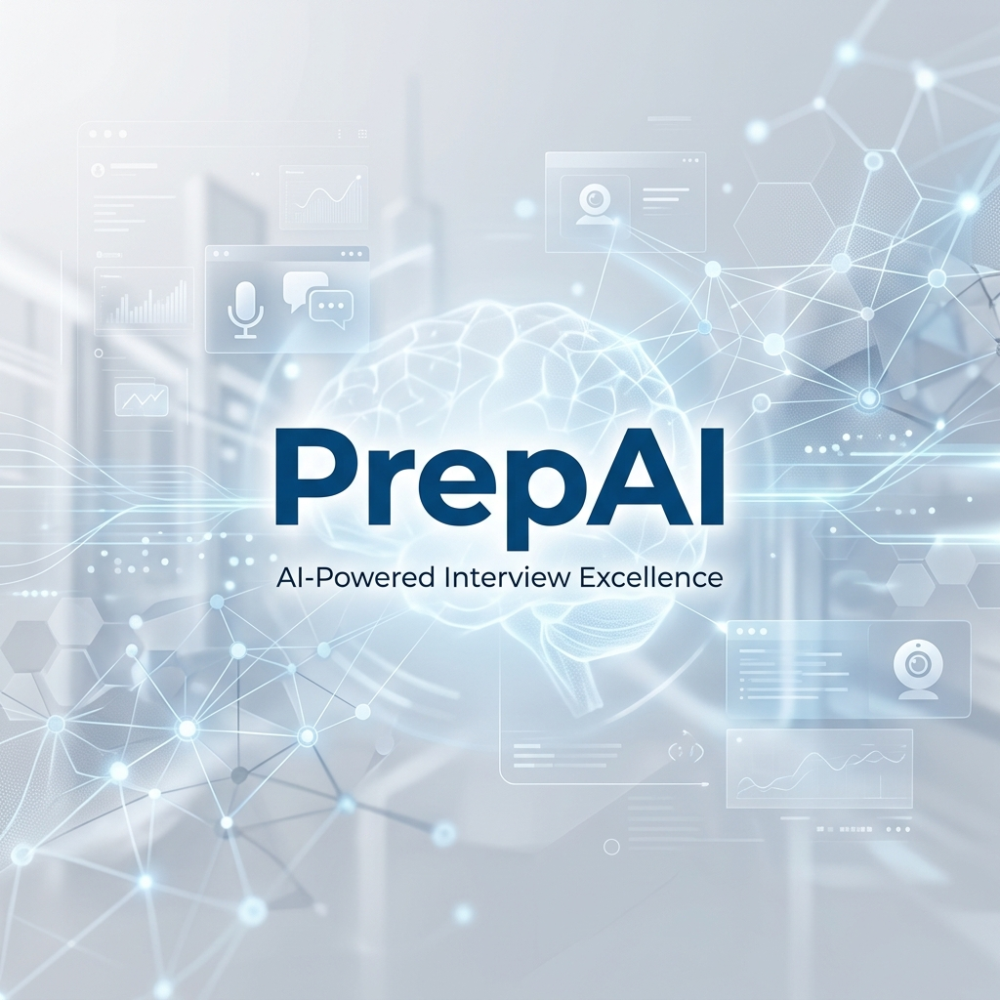

# 💎 PrepAI: Immersive Multimodal Technical Interview Intelligence

<div align="center">
  

  <h3>"Bridging technical competency and behavioral biometrics in a singular, state-of-the-art diagnostic environment."</h3>

  <p align="center">
    
    
    
    
    
  </p>

  <p align="center">
    <b>Empowering candidates to prepare for intense hiring loops while providing administrators with a unified control room to monitor progression at scale.</b>
  </p>
</div>

---

## 🌐 Production Live Link
You can access the production-ready live deployment of PrepAI here:

> [!TIP]
> **🚀 Live Web Application**: [**https://prepai-interview.onrender.com**](https://prepai-interview.onrender.com) _(Note: Render free tier services may take 1-2 minutes to spin up from a cold sleep on first load)._

---

## 🌌 Core Vision & Platform Design
**PrepAI** bridges the gap between mechanical evaluation and dynamic coaching. By integrating advanced **Gemini AI models**, real-time behavioral diagnostics, an interactive **Monaco Editor**, and structured resume parsing, it delivers a high-fidelity environment modeled after elite technical screens. 

The application is built on a custom **glassmorphic dark design system**, optimizing visual focus, reducing fatigue, and creating an immersive experience for candidates and administrators alike.

---

## 🚀 Advanced Tech Stack & Dynamic SDK Integrations

### 👁️ 1. Face-API.js (Computer Vision & Stress Diagnostics)
To evaluate candidate posture and stress under high-intensity interview situations, the platform implements **`@vladmandic/face-api`** on the client side:
*   **Weight Preloading**: Upon starting a live mock session, face-api preloads pre-trained weights from `/models` for the **`TinyFaceDetector`** (for lightning-fast face bounding-box identification) and **`FaceExpressionNet`** (for real-time micro-expression analysis).
*   **Dynamic Expression Polling**: Sets up a 1000ms frame scanning interval on the active camera video feed.
*   **Stress / Nervousness Index**: Uses mathematical vectors mapping specific emotions to calculate real-time nervousness levels:
    $$\text{Stress Score (\%)} = \min\left(100, \left(\text{Fearful} \times 0.5 + \text{Sad} \times 0.2 + \text{Surprised} \times 0.3\right) \times 100\right)$$
*   This score is updated live on the overlay camera screen and sent to the Flask server at `/api/interview/submit` to compile candidate behavioral report data.

### 🎙️ 2. Real-Time Voice Synthesis & Transcribing (HTML5 Web Speech)
PrepAI handles dynamic scenario voice operations directly inside the browser using native **Web Speech APIs**, reducing server-side payload overhead:
*   **Interactive Narrator (Text-to-Speech)**: Uses the **`SpeechSynthesis`** API and custom **`SpeechSynthesisUtterance`** configs to read question prompts, technical constraints, and follow-up prompts out loud. An visual indicator ring pulsates in sync with `onstart` and `onend` events.
*   **Live Audio Recognition (Speech-to-Text)**: Leverages **`webkitSpeechRecognition`** / **`SpeechRecognition`** in continuous mode, converting microphone inputs into real-time transcripts.

### 🧠 3. Generative Orchestration Core (Google Gemini & Ollama)
*   **Gemini Pro / Llama 3 Router**: Flexible AI gateway. Primarily routes complex parsing, coding analysis, and evaluation steps to the Google Gemini API (or falls back to Ollama's local `llama3:8b` weights).
*   **JSON-Strict Parsing**: Utilizes strict system instructions and few-shot formatting rules to guarantee error-free, standard REST outputs.

---

## 🚀 Key Modules & Feature Sets

### 👨‍💻 1. Candidate Features & Activities

*   🎙️ **Dynamic Scenario Simulator (Mock Interviews)**:
    *   **Context-Aware AI Interviewer**: Generates highly tailored questions based on your specific job role, target industry, and uploaded resume contents.
    *   **Conversational Persistence**: The AI remembers your responses, asking challenging, deep-dive follow-up questions to test your architectural limits.
    *   **Comprehensive Scorecards**: Instant breakdowns of your Clarity, Technical Accuracy, and Confidence with actionable improvement recommendations.
*   💻 **The Neural Coding Dojo (Algorithmic IDE)**:
    *   **Professional IDE**: Integrated Monaco Editor supporting full syntax highlighting, autocompletion, and multiple programming languages (Python, Javascript, Java, C++).
    *   **Vast Problem Catalog**: Includes multiple challenges from O(n) algorithmic essentials to complex dynamic programming.
    *   **Deep AI Code Review**: Instantly analyzes code submissions, pointing out time/space complexity (Big-O), potential edge cases, logic bugs, and SOLID/DRY violations.
*   📝 **ATS Resume Scorer & Global Vault**:
    *   **Semantic Scoring Model**: Compares your resume structure and phrasing against specific target descriptions.
    *   **ATS Diagnostics**: Identifies critical keyword gaps, missing technical skills, core formatting issues, and recommendations to bypass filters.
    *   **Global Resume Sync**: Upload a resume once, and it propagates instantly to guide custom questions generated in mock interviews.
*   🧭 **Smart Onboarding & Unified Dashboard**:
    *   **Tailored Roadmap**: A brief, three-question personalized onboarding flow mapping out your level, education, and target stack.
    *   **Interactive Analytics**: Visually track your mock interview history, code challenge completions, and progression trends.
    *   **AI Chatbot Companion**: A floating conversational helper present on your dashboard to provide immediate system tips and technical guidance.

---

### 🛡️ 2. Administrator Features & Dashboard

PrepAI includes a completely separate, highly secure, and visually striking **Administrator Panel** designed to oversee the ecosystem's usage metrics:

*   🔒 **Strict Role Protection**: Access-guarded routes ensure candidate accounts cannot reach administration endpoints.
*   📊 **Single-Page Visual Control Room**:
    *   **Active Registration Metrics**: Displays a single, premium total member tracker card.
    *   **7-Day Growth Trend**: Full-width SVG area chart tracking daily member growth and candidate registration trends over the past week.
    *   **Candidates Preview**: A concise grid preview showing the 5 most recent registrations.
    *   **"See More" Pagination**: Quick redirection pathway to the exhaustive candidate logs database.
*   📂 **Searchable Candidate Register (`/admin/users`)**:
    *   **Complete Log Search**: Allows admins to search the full directory of candidate profiles by Name or Email address.
    *   **Detailed Analytics Columns**: Tracks candidate Email IDs, solved dojo problems, average mock interview scores, total interviews completed, and onboarding status.
*   👁️ **Deep-Dive Activity Popup**:
    *   Clicking a candidate's name from either directory triggers a comprehensive dashboard overlay panel.
    *   📈 **Mock Score Progression Chart**: An SVG line chart rendering that specific user's score history chronologically across interviews.
    *   ⚡ **7-Day Engagement Chart**: An SVG weekly bar chart mapping daily activity count frequencies (interviews, code submissions, resumes uploaded) for that candidate.
    *   🕒 **Live Activity Feed**: A structured timeline logging every technical activity, challenge submitted, or resume uploaded with precise timestamps.
*   🧩 **Tailored Navigation Focus**: Sidebar menus, user profiles, and floating chatbots are automatically hidden when an admin logs in to ensure the dashboard remains fully dedicated to system analytics. A secure **Sign Out** button is permanently anchored to the sticky top header.

---

## 📂 Project Anatomy

```text
Prep_AI/
├── frontend/               # The Reactive Visual Interface (React/Vite)
│   ├── src/
│   │   ├── components/     # Atomic UI Elements (Glassmorphic Forms, ProtectedRoute)
│   │   ├── context/        # Global State Management (AuthContext)
│   │   ├── pages/          # Full-Page View Controllers (Dashboard, Onboarding, Dojo, AdminDashboard)
│   │   └── services/       # Centralized API Orchestration Layer (Axios)
│   └── package.json
├── backend/                # The Neural Operations Core (Flask)
│   ├── routes/             # Blueprint-based API Endpoints (auth, admin, interview, dojo)
│   ├── utils/              # Providers (AI, CV, Auth, Parser)
│   ├── models/             # Schema-less Data Definitions
│   ├── scripts/            # Infrastructure Management (init_db.py)
│   ├── main.py             # System Gateway & Entry Point
│   └── requirements.txt    # Python Dependencies
├── ml/                     # Machine Learning Research Laboratory
├── package.json            # Root orchestrator (Concurrent runner)
└── PROJECT_STATE.md        # Technical architectural notes
```

---

## 🔧 Step-by-Step Installation & Local Setup

To run the PrepAI ecosystem locally, follow this guide precisely:

### Step 1: Clone & Check Prerequisites
Make sure you have the following installed on your machine:
*   [Node.js](https://nodejs.org/en) (v18 or higher)
*   [Python](https://www.python.org/downloads/) (v3.10 or higher)
*   [MongoDB](https://www.mongodb.com/try/download/community) (Local server or MongoDB Atlas cluster connection string)

### Step 2: Database & API Key Configuration
Create a `.env` file inside the `backend/` directory and configure the environment:
```env
# Database Configuration
MONGO_URI=mongodb://localhost:27017/prepai   # Or your MongoDB Atlas connection string
DB_NAME=prepai

# Security Token (JWT)
SECRET_KEY=your_super_secret_jwt_key

# Distributed AI Core (Use gemini or ollama)
AI_PROVIDER=gemini
GEMINI_API_KEY=your_gemini_api_key_here

# Local AI (Optional fallback)
OLLAMA_HOST=http://127.0.0.1:11434
OLLAMA_MODEL=llama3:8b

# Port Configuration
PORT=5000
```

### Step 3: Fast Install (Root Directory)
PrepAI is configured as a Monorepo. Install all npm modules, set up the backend Python virtual environment (`.venv`), and fetch python dependencies with a single command from the **root directory**:
```bash
npm run install-all
```

### Step 4: Initialize MongoDB Collections
Before starting the servers, configure indexes and import the admin user account credentials.
Set up default credentials (**email**: `admin@gmail.com` | **password**: `admin123`) using the initialization script:
```bash
# Navigate to the backend directory
cd backend

# Activate Virtual Environment
# Windows:
.venv\Scripts\activate
# Mac/Linux:
source .venv/bin/activate

# Initialize collections
python scripts/init_db.py
```
*You should see a "Database initialization completed successfully!" message.*

---

## 🚀 How to Run the Project Locally

You can launch both the backend server and the frontend interface concurrently with a single command from the **root directory (`Prep_AI/`)**:

```bash
npm run dev
```

### Server Allocation
*   **Vite Frontend Development Server**: Runs on [**http://localhost:5173**](http://localhost:5173)
*   **Flask Backend API Server**: Runs on [**http://localhost:5000**](http://localhost:5000)

Open your browser and navigate to **http://localhost:5173**. Log in as a Candidate to experience technical training, or log in using the credentials below to access the Admin Panel:
*   **Admin Email**: `admin@gmail.com`
*   **Admin Password**: `admin123`

---

## 🏆 THE IMPACT & ROADMAP
PrepAI is engineered to empower job seekers by bringing high-fidelity diagnostic tools right to their browsers. By evaluating confidence alongside raw technical competency, we provide candidates with the insights they need to conquer competitive hiring loops and succeed in their careers.

**Prepare for the best. Be the better.**

---

<div align="center">
  <p>Engineered for Excellence by <b>Prathmesh Nitnaware</b></p>
  <a href="https://github.com/prathmesh-nitnaware">
    
  </a>
  
</div>
