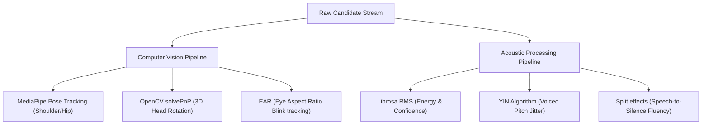

# 💎 PrepAI: Immersive Multimodal Technical Interview Intelligence

<div align="center">
  

  <h3><i>"Bridging technical competency and behavioral biometrics in a singular, state-of-the-art diagnostic environment."</i></h3>

  <p align="center">
    <a href="https://github.com/prathmesh-nitnaware/Prep_AI">
      
    </a>
    <a href="https://github.com/prathmesh-nitnaware/Prep_AI">
      
    </a>
    <a href="https://github.com/prathmesh-nitnaware/Prep_AI">
      
    </a>
  </p>
  <p align="center">
    <a href="https://github.com/prathmesh-nitnaware/Prep_AI">
      
    </a>
    <a href="https://github.com/prathmesh-nitnaware/Prep_AI">
      
    </a>
    <a href="https://github.com/prathmesh-nitnaware/Prep_AI">
      
    </a>
  </p>

  <p align="center">
    <b>Empowering candidates to conquer high-pressure technical screenings, and offering administrators a unified dashboard to monitor progression.</b>
  </p>
</div>

---

## 🌐 Production Deployment

> [!IMPORTANT]
> **🚀 Live Web Application**: [**https://prepai-interview.onrender.com**](https://prepai-interview.onrender.com)
>
> _Note: Hosted on Render's cloud cluster. Please allow 1-2 minutes on the first load for the free tier web container to spin up from cold sleep state._

---

## 🌌 Platform Architecture & Comparative Advantage

Traditional interview preparation platforms are static and passive. **PrepAI** disrupts this model by introducing a **synchronous diagnostic loop** correlating technical, behavioral, and acoustic vectors in real-time.

| Feature Category | Traditional Tools | PrepAI AI Hybrid |
| :--- | :--- | :--- |
| **Interviewer Presence** | Static Question List | **Google Gemini AI Agent** with contextual follow-up memory |
| **Behavioral Feedback** | None | **MediaPipe / OpenCV** face posture & gaze metrics |
| **Speech Analytics** | Standard Recording | **Librosa YIN** acoustic confidence & stress classification |
| **Voice Interaction** | Text-only input | **HTML5 Speech Recognition** (Voice-to-Text) |
| **Code Submissions** | Basic Compiler | **Neural Monaco IDE** with automated space/time complexity reviews |

---

## 🤖 The Custom Machine Learning Laboratory (`/ml`)

PrepAI implements custom-trained pipelines directly in the **`/ml`** directory, processing candidate behavioral signals locally on frame-by-frame feeds:



### 🤸‍♂️ 1. Pose Tracking & Posture Analytics (`/ml/cv/posture_analysis.py`)
Uses the **MediaPipe Pose** solution to track spatial alignments:
*   Maps spatial metrics for key joints (`LEFT_SHOULDER`, `RIGHT_SHOULDER`, `LEFT_HIP`, and `RIGHT_HIP`).
*   Implements inverse tangent equations to check angular slopes:
    $$\theta_{\text{shoulder}} = \text{deg}\left(\arctan2\left(Y_{\text{right}} - Y_{\text{left}}, X_{\text{right}} - X_{\text{left}}\right)\right)$$
*   Detects if a candidate is slouching, exhibiting signs of discomfort, or shifting away from the focal frame during high-intensity scenarios.

### 👓 2. Gaze Integrity & Head Rotation (`/ml/cv/eye_tracking.py`)
*   **3D Head Pose Mapping**: Implements **`cv2.solvePnP`** (Perspective-n-Point) to calculate 3D head rotation angles (Pitch, Yaw, Roll) based on MediaPipe coordinates mapped to standard 3D human facial vectors. Logs warnings if rotation exceeds a $15^\circ$ angle (detecting if candidates are looking away to read notes).
*   **Eye Aspect Ratio (EAR) Blink Detection**: Integrates dynamic vertical-to-horizontal eye aspect equations to compute eye fatigue levels while suppressing blinks during vocal mouth movement (talking detector integration).

### 📈 3. Acoustic Processing & Vocal Emotion Analytics (`/ml/audio/emotion_detector.py`)
*   **Confidence Metrics**: Analyzes root-mean-square (RMS) energy (`librosa.feature.rms`) from acoustic waveforms to measure voice volume.
*   **Nervousness Jitter**: Runs the **YIN Pitch Algorithm** (`librosa.pyin`) over voiced speech. Pitch standard deviation ($\sigma_{f0}$) variation is measured to identify stress indicators.
*   **Fluency Index**: Utilizes silent-interval splits (`librosa.effects.split`) to evaluate speech-to-pause ratios, identifying verbal hesitations.

---

## 🚀 Key Modules & Feature Sets

### 👨‍💻 1. Candidate Features & Activities

*   🎙️ **Dynamic Scenario Simulator (Mock Interviews)**:
    *   **Context-Aware AI Interviewer**: Generates highly tailored questions based on your specific job role, target industry, and uploaded resume contents.
    *   **Conversational Persistence**: The AI remembers your responses, asking challenging, deep-dive follow-up questions to test your architectural limits.
    *   **Speech Narration**: Immersive vocal readings of prompt cards using HTML5 Web Speech.
    *   **Comprehensive Scorecards**: Instant breakdowns of your Clarity, Technical Accuracy, and Confidence with actionable improvement recommendations.
*   💻 **The Neural Coding Dojo (Algorithmic IDE)**:
    *   **Professional IDE**: Integrated Monaco Editor supporting full syntax highlighting, autocompletion, and multiple programming languages (Python, Javascript, Java, C++).
    *   **Deep AI Code Review**: Instantly analyzes code submissions, pointing out time/space complexity (Big-O), potential edge cases, logic bugs, and SOLID/DRY violations.
*   📝 **ATS Resume Scorer & Global Vault**:
    *   **Semantic Scoring Model**: Compares your resume structure and phrasing against specific target descriptions.
    *   **ATS Diagnostics**: Identifies critical keyword gaps, missing technical skills, and ATS bot counter-measures.
    *   **Global Resume Sync**: Upload a resume once, and it propagates instantly to guide custom questions generated in mock interviews.
*   🧭 **Smart Onboarding & Unified Dashboard**:
    *   **Tailored Roadmap**: A brief, three-question personalized onboarding flow mapping out your level, education, and target stack.
    *   **Interactive Analytics**: Visually track your mock interview history, code challenge completions, and progression trends.
    *   **AI Chatbot Companion**: A floating conversational helper present on your dashboard to provide immediate system tips and technical guidance.

---

### 🛡️ 2. Administrator Features & Dashboard

PrepAI includes a completely separate, highly secure, and visually striking **Administrator Panel** designed to oversee the ecosystem's usage metrics:

*   🔒 **Strict Role Protection**: Access-guarded routes ensure candidate accounts cannot reach administration endpoints.
*   📊 **Single-Page Visual Control Room**:
    *   **Active Registration Metrics**: Displays a single, premium total member tracker card.
    *   **7-Day Growth Trend**: Full-width SVG area chart tracking daily member growth and candidate registration trends over the past week.
    *   **Candidates Preview**: A concise grid preview showing the 5 most recent registrations.
    *   **"See More" Pagination**: Quick redirection pathway to the exhaustive candidate logs database.
*   📂 **Searchable Candidate Register (`/admin/users`)**:
    *   **Complete Log Search**: Allows admins to search the full directory of candidate profiles by Name or Email address.
    *   **Detailed Analytics Columns**: Tracks candidate Email IDs, solved dojo problems, average mock interview scores, total interviews completed, and onboarding status.
*   👁️ **Deep-Dive Activity Popup**:
    *   Clicking a candidate's name from either directory triggers a comprehensive dashboard overlay panel.
    *   📈 **Mock Score Progression Chart**: An SVG line chart rendering that specific user's score history chronologically across interviews.
    *   ⚡ **7-Day Engagement Chart**: An SVG weekly bar chart mapping daily activity count frequencies (interviews, code submissions, resumes uploaded) for that candidate.
    *   🕒 **Live Activity Feed**: A structured timeline logging every technical activity, challenge submitted, or resume uploaded with precise timestamps.
*   🧩 **Tailored Navigation Focus**: Sidebar menus, user profiles, and floating chatbots are automatically hidden when an admin logs in to ensure the dashboard remains fully dedicated to system analytics. A secure **Sign Out** button is permanently anchored to the sticky top header.

---

## 📂 Project Anatomy

```text
Prep_AI/
├── frontend/               # The Reactive Visual Interface (React/Vite)
│   ├── src/
│   │   ├── components/     # Atomic UI Elements (Glassmorphic Forms, ProtectedRoute)
│   │   ├── context/        # Global State Management (AuthContext)
│   │   ├── pages/          # Full-Page View Controllers (Dashboard, Onboarding, Dojo, AdminDashboard)
│   │   └── services/       # Centralized API Orchestration Layer (Axios)
│   └── package.json
├── backend/                # The Neural Operations Core (Flask)
│   ├── routes/             # Blueprint-based API Endpoints (auth, admin, interview, dojo)
│   ├── utils/              # Providers (AI, CV, Auth, Parser)
│   ├── models/             # Schema-less Data Definitions
│   ├── scripts/            # Infrastructure Management (init_db.py)
│   ├── main.py             # Gateway Server Entry Point
│   └── requirements.txt    # Python Dependencies
├── ml/                     # Machine Learning Research Laboratory (Pose, Gaze, Audio, NLP)
├── package.json            # Root orchestrator (Concurrent runner)
└── PROJECT_STATE.md        # Technical architectural notes
```

---

## 🔧 Step-by-Step Installation & Local Setup

To run the PrepAI ecosystem locally, follow this guide precisely:

### Step 1: Clone & Check Prerequisites
Make sure you have the following installed on your machine:
*   [Node.js](https://nodejs.org/en) (v18 or higher)
*   [Python](https://www.python.org/downloads/) (v3.10 or higher)
*   [MongoDB](https://www.mongodb.com/try/download/community) (Local server or MongoDB Atlas cluster connection string)

### Step 2: Database & API Key Configuration
Create a `.env` file inside the `backend/` directory and configure the environment:
```env
# Database Configuration
MONGO_URI=mongodb://localhost:27017/prepai   # Or your MongoDB Atlas connection string
DB_NAME=prepai

# Security Token (JWT)
SECRET_KEY=your_super_secret_jwt_key

# Distributed AI Core (Use gemini or ollama)
AI_PROVIDER=gemini
GEMINI_API_KEY=your_gemini_api_key_here

# Local AI (Optional fallback)
OLLAMA_HOST=http://127.0.0.1:11434
OLLAMA_MODEL=llama3:8b

# Port Configuration
PORT=5000
```

### Step 3: Fast Install (Root Directory)
PrepAI is configured as a Monorepo. Install all npm modules, set up the backend Python virtual environment (`.venv`), and fetch python dependencies with a single command from the **root directory**:
```bash
npm run install-all
```

### Step 4: Initialize MongoDB Collections
Before starting the servers, configure indexes and import the admin user account credentials.
Set up default credentials (**email**: `admin@gmail.com` | **password**: `admin123`) using the initialization script:
```bash
# Navigate to the backend directory
cd backend

# Activate Virtual Environment
# Windows:
.venv\Scripts\activate
# Mac/Linux:
source .venv/bin/activate

# Initialize collections
python scripts/init_db.py
```
*You should see a "Database initialization completed successfully!" message.*

---

## 🚀 How to Run the Project Locally

You can launch both the backend server and the frontend interface concurrently with a single command from the **root directory (`Prep_AI/`)**:

```bash
npm run dev
```

### Server Allocation
*   **Vite Frontend Development Server**: Runs on [**http://localhost:5173**](http://localhost:5173)
*   **Flask Backend API Server**: Runs on [**http://localhost:5000**](http://localhost:5000)

Open your browser and navigate to **http://localhost:5173**. Log in as a Candidate to experience technical training, or log in using the credentials below to access the Admin Panel:
*   **Admin Email**: `admin@gmail.com`
*   **Admin Password**: `admin123`

---

## 🏆 THE IMPACT & ROADMAP
PrepAI is engineered to empower job seekers by bringing high-fidelity diagnostic tools right to their browsers. By evaluating confidence alongside raw technical competency, we provide candidates with the insights they need to conquer competitive hiring loops and succeed in their careers.

**Prepare for the best. Be the better.**

---

<div align="center">
  <p>Engineered for Excellence by <b>Prathmesh Nitnaware</b></p>
  <a href="https://github.com/prathmesh-nitnaware">
    
  </a>
  
</div>
