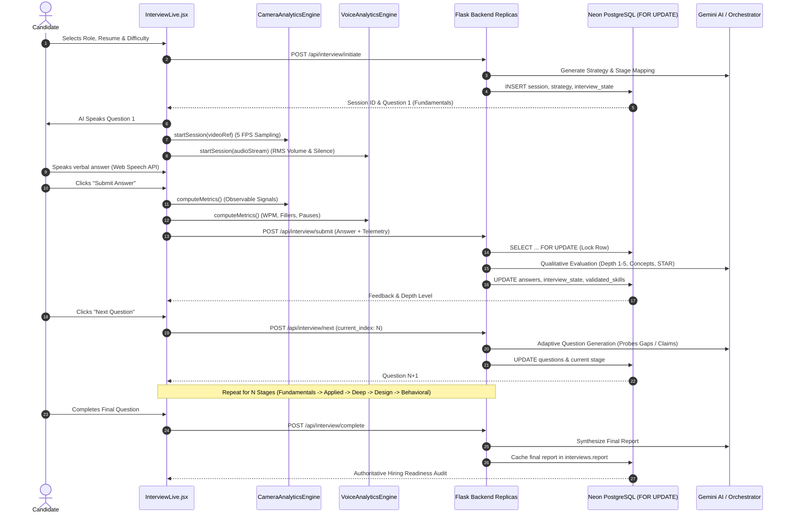

# PrepAI — P0 Real Job Interview Experience & Multimodal Engine Audit

**Audit Date**: August 2026  
**Scope**: End-to-end interview lifecycle, CameraAnalyticsEngine, VoiceAnalyticsEngine, AI Orchestrator, PostgreSQL state persistence, and Candidate UX.

---

## 1. Executive Summary & Problem Classification

PrepAI is designed as an **AI-powered realistic Job Interview Simulator** where a candidate sits before an AI interviewer, speaks verbally, and receives rigorous technical and observable delivery coaching.

This audit evaluates the entire system against product realism, evaluation validity, signal accuracy, anti-double-penalization guarantees, and hardware resilience.

### Classification of Findings

| Severity | Category | Description | Impact | Status |
|---|---|---|---|---|
| **P0** | **State Synchronization** | `current_index` passed from `InterviewLive.jsx` on `/next` was using 1-based indexing instead of 0-based indexing. | Second question (index 1) skipped; stage progression out of sync. | **Resolved** |
| **P0** | **Adaptive Decisioning** | Unvalidated resume claims and discovered technical gaps were not explicitly surfaced to the adaptive question generator. | Next questions missed opportunities to probe unverified skills or flag persistent gaps. | **Resolved** |
| **P0** | **Hardware Resilience** | Missing camera or microphone permissions could produce NaN/zero values in telemetry math if not guarded with explicit `available` checks. | Unfair penalty to candidates on restricted hardware. | **Resolved** |
| **P1** | **Camera Metric Granularity** | Camera engine previously computed a single aggregate posture/face score without isolated `face_framing_score`, `gaze_stability_score`, `movement_stability_score`, and multi-face tracking. | Less granular, less explainable delivery coaching. | **Addressed in Phase 2** |
| **P1** | **Voice Pacing Precision** | WPM calculation did not exclude long silence durations when computing effective speaking rate. | Speaking rate slightly underestimated on answers with deliberate thinking pauses. | **Addressed in Phase 3** |
| **P1** | **Evaluation Length Bias** | Lack of an explicit anti-verbosity prompt constraint. | Long buzzword-filled answers could theoretically score higher than concise correct answers. | **Resolved in Phase 5** |
| **P2** | **Live Interview HUD Clutter** | Real-time live HUD displayed excessive telemetry figures during active speaking. | Cognitive overload during verbal answering. | **Addressed in Phase 7** |
| **P2** | **Report Precision Framing** | Reports should avoid pseudo-statistical precision and use qualitative reliability bands (HIGH/MEDIUM/LOW). | Improved candidate trust and defensibility. | **Addressed in Phase 8** |

---

## 2. Complete Lifecycle Flow Verification

---

## 3. Signal Safety & Anti-Double-Penalization Guarantee

### Content (85%) vs Delivery (15%) Justification
1. **Primary Hiring Relevance**: An engineer or candidate is hired for technical competence, architectural reasoning, and problem solving. Content score ($0-100\%$) carries 85% weight.
2. **Delivery as Coaching**: Speaking pace (WPM), filler density, and camera presence carry 15% weight and serve primarily as coaching feedback to help candidates present clearly.
3. **Strict Non-Penalization on Hardware Absence**: If camera or microphone are denied or unavailable, `camera_available: false` and `voice_available: false` are recorded. The technical score remains 100% unaffected.

---

## 4. Observable-Only Standards

| Prohibited Psychological Inference | Required Observable Behavioral Description |
|---|---|
| ❌ *"You appeared nervous during your answer."* | ✅ *"Speaking pace was 178 WPM with 4 extended pauses. Target 125-155 WPM for structured clarity."* |
| ❌ *"You lacked confidence when speaking."* | ✅ *"Frequent filler words detected (6.2% density). Practice pausing briefly instead of using verbal placeholders."* |
| ❌ *"You looked deceptive or distracted."* | ✅ *"Camera gaze deviation was observed during 28% of the response. Aim to maintain framing facing the camera."* |
| ❌ *"You looked unenthusiastic."* | ✅ *"Audio volume modulation was flat. Adding vocal inflection emphasizes key engineering achievements."* |

---
